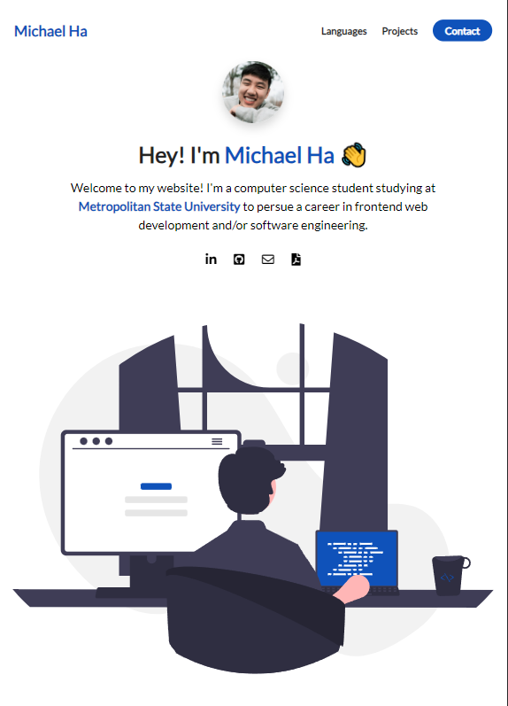

# My Personal Website

Welcome to my personal website! This is a showcase of my skills in web development, and I've designed it using HTML and CSS.

Still a WIP as I grind out new projects to showcase later on, so the projects section isn't allocated at the moment.

## Live Deployment

You can access the live deployment of my website at [Link](https://guacamoley.github.io/eportfolio-website/).

## Main Features

### 1. Responsive Layout

My website is designed to be fully responsive, ensuring an optimal viewing experience across a wide range of devices, from large desktop screens to small mobile displays. No matter how you access it, you'll find that the website adjusts seamlessly to fit your screen.

### 2. Smooth Scrolling Animations

I've incorporated smooth scrolling animations that make navigating the website a visually appealing experience. Whether you're scrolling down the homepage or using the navigation menu, you'll notice that the transitions are seamless and elegant.

### 3. Popup Animations

To engage visitors and provide an interactive experience, I've included various popup animations throughout the website. These popups display additional information, images, or other content in an attractive and user-friendly manner.

## Technologies Used

- **HTML**: The backbone of my website, providing the structure and content.
- **CSS**: Used to style the website and create responsive layouts.

## How to Use

To explore my website, simply follow the link provided above. There, you'll find a well-structured and intuitive user interface that makes navigation a breeze.

## Feedback and Contributions

I'm always open to feedback and suggestions. If you have any ideas or would like to report a bug, please don't hesitate to reach out to me through the contact information provided on the website.

If you'd like to contribute or collaborate with me, I'm open to that as well. Let's work together to make the web a more beautiful and functional place!

## License

This project is licensed under the [Do What The F\*ck You Want To Public License (WTFPL)](LICENSE). You are free to do whatever the f\*ck you want with this code.

---

Thank you for visiting my personal website. I hope you enjoy exploring it as much as I enjoyed creating it!
